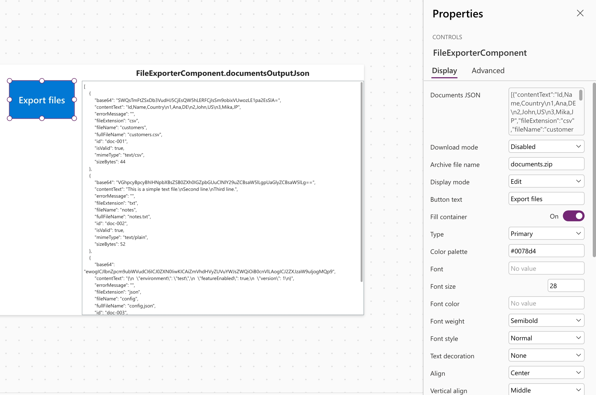
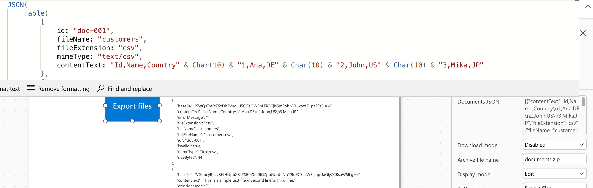
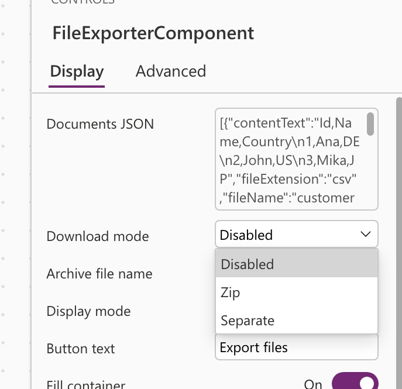
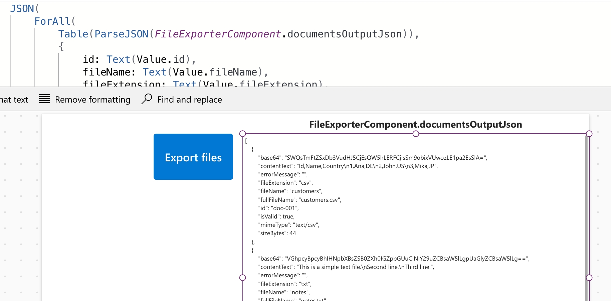
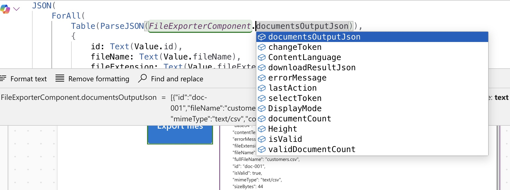

# File Exporter Component PCF


Power Apps PCF control for Canvas apps that exports one or more files from JSON input, supports local downloads, and exposes JSON outputs for Power Automate and external systems such as SharePoint.

## Visual Preview

Canvas app control preview:



PCF properties in Canvas apps:



Download mode property:



Output JSON property:



Output status properties:



## What This PCF Supports

- Multi-document input via `documentsJson`
- `downloadMode = Disabled | Zip | Separate`
- ZIP download in the browser without Power Automate
- Separate-file browser download as a best-effort mode
- JSON outputs for downstream Power Fx and Power Automate usage
- Base64 per document inside `documentsOutputJson`
- `OnSelect` event and output tokens (`selectToken`, `changeToken`) for Canvas formulas
- Button styling inputs for text, colors, border, padding, alignment, and type

## Important Behavior Notes

- `Disabled` download mode does not download files. It only updates outputs.
- `Zip` is the safest built-in download mode.
- `Separate` may be limited by browser or host behavior because it triggers multiple downloads.
- `archiveFileName` is only used when `downloadMode = Zip`.
- The control outputs processed documents as JSON text, so Canvas apps typically parse it with `ParseJSON()`.

## Quickstart

### Local PCF harness

```bash
cd pcf/FileExporterComponent
npm install
npm run refreshTypes
npm run build
npm run start
```

### Build the Dataverse solution

```bash
dotnet build solution/File_Exporter_Component_Solution/File_Exporter_Component_Solution.cdsproj -c Release
```

Managed-only:

```bash
dotnet build solution/File_Exporter_Component_Solution/File_Exporter_Component_Solution.cdsproj -c Release /p:SolutionPackageType=Managed
```

Outputs are generated under:

- `solution/File_Exporter_Component_Solution/bin/Release/`

## Basic Usage

1. Add the control to a Canvas app from the imported solution.
2. Bind `documentsJson` to a JSON array of documents.
3. Set `downloadMode`:
   - `Disabled` for output-only / Flow-driven scenarios
   - `Zip` for one archive download
   - `Separate` for one download per valid file
4. Read `documentsOutputJson` and `downloadResultJson` from the control outputs.
5. Use `OnSelect`, `selectToken`, or `changeToken` when you need app-side formulas to react to clicks or output changes.

## Example `documentsJson`

```json
[
  {
    "id": "doc-001",
    "fileName": "customers",
    "fileExtension": "csv",
    "mimeType": "text/csv",
    "contentText": "Id,Name,Country\n1,Ana,DE\n2,John,US\n3,Mika,JP"
  },
  {
    "id": "doc-002",
    "fileName": "notes",
    "fileExtension": "txt",
    "mimeType": "text/plain",
    "contentText": "This is a simple text file.\nSecond line.\nThird line."
  }
]
```

## Send Files To SharePoint With Power Automate

Typical pattern:

1. Set `downloadMode = Disabled`
2. Let the control produce `documentsOutputJson`
3. In Canvas, send that JSON string to a Flow
4. In Flow, use `Parse JSON`
5. Loop through the array
6. Convert each `base64` field to binary
7. Create the file in SharePoint

This is useful when:

- files should be stored centrally instead of downloaded locally
- you want auditability or approval flows
- you need to send files to SharePoint, Dataverse-related automation, or other external systems

## Docs

- [PCF usage guide](docs/pcf-usage.md)
- [Properties and outputs](docs/properties.md)
- [Solution packaging](docs/solution-package.md)

## Contributing

Contributions are welcome.

- Fork the repo and open a pull request, or use a branch + PR if you have access.
- Prefer pull requests over direct pushes to `main`.
- Open an issue first if you want to discuss a bug or feature request.

## Creator

Harllens George de la Cruz, The Boring Cat  
https://theboringcat.com/

## License

Apache-2.0. See [LICENSE](LICENSE).
